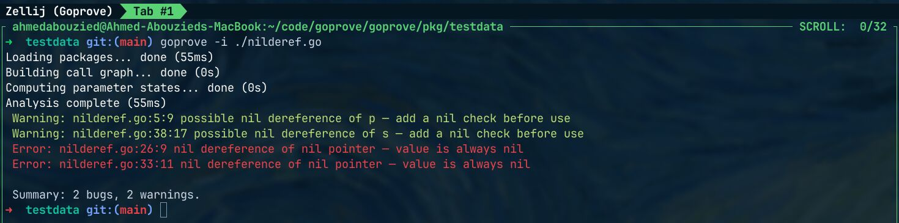

Now that AI is writing a lot of production code. We need to have as many checks and validators as possible to validate the code AI writes. That's why I want to share "goprove". A project I have been cooking for more than a month (by hand, AI helped a lot with testing for edge cases though).

[goprove.dev](https://goprove.dev/)

It's a "prover" for Golang. A prover that mathematically proves that your Go code is safe against certain issues such as nil pointer panics and integer overflows. Go was not built for safe mission-critical software. You will not be building a medical ICU monitor in Go (well, I certainly hope not XD). That's a C++ job with all the tools that prove C++ code and certify it against explicit safety certification standards. And Rust has been catching up to this game.

Yet, we build applications in Go that deserve to be safe and held up to high safety standards. Finance apps, car sharing and transportation, etc. And having these apps fail on you because of a division by zero error or a nil pointer is damn annoying.

Uber built NilAway for nil checking, and it's a great tool. goprove takes a fundamentally different approach — abstract interpretation — which traces the possible value ranges of every variable across all execution paths. This lets it catch not just nil issues but also division by zero and integer overflow with mathematical precision. A detailed comparison is in the Github README.

Install it and give it a go. Let me know how it goes.

